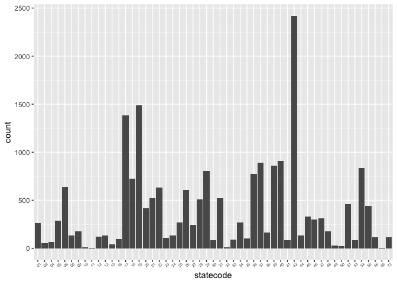
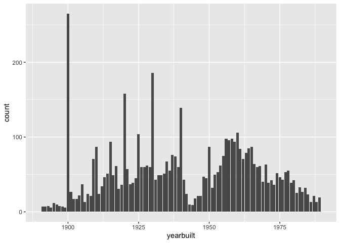

Bridges
================

``` r
#Importing Data
library(readr)
temp <- tempfile()
download.file("https://www.fhwa.dot.gov/bridge/nbi/2018hwybronefiledel.zip",temp)
data <- read_delim(unz(temp, "2018HwyBridgesDelimitedAllStates.txt"), ",", col_names = T)
```

    ## Parsed with column specification:
    ## cols(
    ##   .default = col_double(),
    ##   STATE_CODE_001 = col_character(),
    ##   STRUCTURE_NUMBER_008 = col_character(),
    ##   ROUTE_NUMBER_005D = col_character(),
    ##   HIGHWAY_DISTRICT_002 = col_character(),
    ##   COUNTY_CODE_003 = col_character(),
    ##   FEATURES_DESC_006A = col_character(),
    ##   CRITICAL_FACILITY_006B = col_logical(),
    ##   FACILITY_CARRIED_007 = col_character(),
    ##   LOCATION_009 = col_character(),
    ##   LRS_INV_ROUTE_013A = col_character(),
    ##   LONG_017 = col_character(),
    ##   MAINTENANCE_021 = col_character(),
    ##   OWNER_022 = col_character(),
    ##   FUNCTIONAL_CLASS_026 = col_character(),
    ##   RAILINGS_036A = col_character(),
    ##   TRANSITIONS_036B = col_character(),
    ##   APPR_RAIL_036C = col_character(),
    ##   APPR_RAIL_END_036D = col_character(),
    ##   NAVIGATION_038 = col_character(),
    ##   OPEN_CLOSED_POSTED_041 = col_character()
    ##   # ... with 42 more columns
    ## )

    ## See spec(...) for full column specifications.

    ## Warning: 65769 parsing failures.
    ##  row                     col               expected actual         file
    ## 4178 OTHER_STATE_CODE_098A   1/0/T/F/TRUE/FALSE        134 <connection>
    ## 4964 OTHER_STATE_CODE_098A   1/0/T/F/TRUE/FALSE        134 <connection>
    ## 5205 INSPECT_FREQ_MONTHS_091 no trailing characters        <connection>
    ## 7829 OTHER_STATE_CODE_098A   1/0/T/F/TRUE/FALSE        134 <connection>
    ## 8780 OTHER_STATE_CODE_098A   1/0/T/F/TRUE/FALSE        124 <connection>
    ## .... ....................... ...................... ...... ............
    ## See problems(...) for more details.

``` r
unlink(temp)
```

``` r
#Subsetting to make smaller dataset with variables of interest

myvars <- c("STATE_CODE_001", "STRUCTURE_NUMBER_008", "COUNTY_CODE_003", "ROUTE_PREFIX_005B", "SERVICE_LEVEL_005C", "MAINTENANCE_021", "YEAR_BUILT_027", "ADT_029", "HISTORY_037", "DECK_COND_058", "SUPERSTRUCTURE_COND_059", "CHANNEL_COND_061")
subset <- data[myvars]
names <- c("statecode", "structure.number", "countycode", "route.prefix", "service.level", "maintenance.responsibility", "yearbuilt", "avg.daily.traffic", "historical.significance", "deck.condition", "superstructure.condition", "channel.condition")
names(subset) <- names
```

``` r
subset$superstructure.condition <- as.numeric(as.character(subset$superstructure.condition))
```

    ## Warning: NAs introduced by coercion

``` r
subset$avg.daily.traffic <- as.numeric(as.character(subset$avg.daily.traffic))
str(subset)
```

    ## Classes 'tbl_df', 'tbl' and 'data.frame':    616096 obs. of  12 variables:
    ##  $ statecode                 : chr  "01" "01" "01" "01" ...
    ##  $ structure.number          : chr  "00000000000S702" "00000000000S703" "0000000000M0022" "000000883039900" ...
    ##  $ countycode                : chr  "053" "053" "113" "059" ...
    ##  $ route.prefix              : num  6 6 8 4 3 6 4 4 6 5 ...
    ##  $ service.level             : num  1 1 1 1 1 2 1 1 8 0 ...
    ##  $ maintenance.responsibility: chr  "62" "62" "74" "67" ...
    ##  $ yearbuilt                 : num  1999 2002 1942 1974 1937 ...
    ##  $ avg.daily.traffic         : num  50 159 375 300 6200 3620 400 150 350 15 ...
    ##  $ historical.significance   : num  5 5 5 5 4 1 2 5 5 5 ...
    ##  $ deck.condition            : chr  "8" "8" "5" "7" ...
    ##  $ superstructure.condition  : num  8 8 5 7 6 5 4 4 7 4 ...
    ##  $ channel.condition         : chr  "8" "7" "6" "7" ...
    ##  - attr(*, "problems")=Classes 'tbl_df', 'tbl' and 'data.frame': 65769 obs. of  5 variables:
    ##   ..$ row     : int  4178 4964 5205 7829 8780 10119 13352 13980 14974 15190 ...
    ##   ..$ col     : chr  "OTHER_STATE_CODE_098A" "OTHER_STATE_CODE_098A" "INSPECT_FREQ_MONTHS_091" "OTHER_STATE_CODE_098A" ...
    ##   ..$ expected: chr  "1/0/T/F/TRUE/FALSE" "1/0/T/F/TRUE/FALSE" "no trailing characters" "1/0/T/F/TRUE/FALSE" ...
    ##   ..$ actual  : chr  "134" "134" " " "134" ...
    ##   ..$ file    : chr  "<connection>" "<connection>" "<connection>" "<connection>" ...

``` r
#Investigating Bridges with conditions labeled "poor" (4) or below
library(ggplot2)
library(dplyr)
```

    ## 
    ## Attaching package: 'dplyr'

    ## The following objects are masked from 'package:stats':
    ## 
    ##     filter, lag

    ## The following objects are masked from 'package:base':
    ## 
    ##     intersect, setdiff, setequal, union

``` r
subset.poor <- subset %>% 
  filter(superstructure.condition <= 4)

states.poor <- ggplot(subset.poor, aes(x=statecode)) + geom_bar()
states.poor + theme(axis.text.x = element_text(size = 5, angle=45))
```

<!-- -->

``` r
#Visibly it's clear state codes 17, 19, and 42 have many more "poor" rated bridges than others
#Illinois, Iowa, and Pennsylvania
```

``` r
#Filtering between Illinos, Iowa and Pennsylvania
subset.poor %>% 
  filter(statecode %in% c(17, 19, 42)) %>% 
ggplot(., aes(x=yearbuilt)) + geom_bar() + xlim(1890, 1990)
```

    ## Warning: Removed 198 rows containing non-finite values (stat_count).

    ## Warning: Removed 2 rows containing missing values (geom_bar).

<!-- -->

``` r
#We see a lot of the poor conditioned bridges were built in the year 1900
```

``` r
# Get county fips code
# BLS Fips code analysis
#Table with FIPS code state + county combo + BLS stat (Civilian Labor Force) + bridges
# Test new
library(blscrapeR)
county_df <- get_bls_county()
```

``` r
subset$fips = paste(subset$statecode, subset$countycode, sep = "")

tidy.data <-  subset %>% 
  group_by(fips) %>% 
  summarise(mean.condition = mean(superstructure.condition, na.rm = T),
            mean.traffic = mean(avg.daily.traffic)) %>% 
    left_join(select(county_df, labor_force, unemployed_rate, fips), by = "fips")
```

``` r
#Filtering for Maricopa County, AZ
maricopa <- county_df %>% 
  filter(fips == "04013") 

bridges_maricopa <- subset %>% 
  filter(statecode == "04", 
         countycode == "013")

bridges_maricopa$fips = paste(bridges_maricopa$statecode, bridges_maricopa$countycode, sep = "")
```
